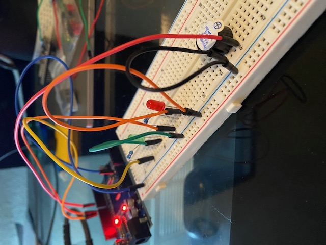
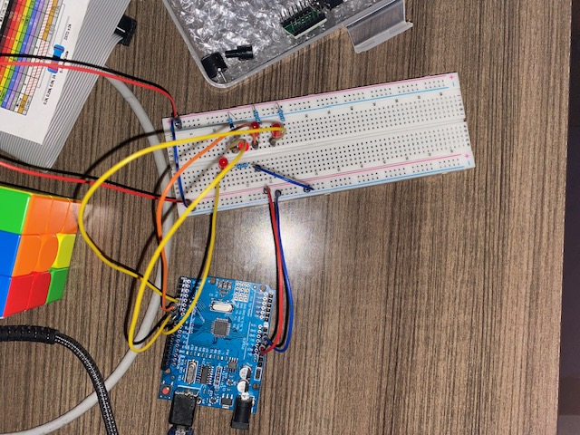

<h1 align="center">Welcome 👋, I'm Jonathan</h1>
<h3 align="center">A Recent FSU Statistics and Computer Science Grad Exploring Robotics and Hardware Engineering</h3>

   
  

I've been interested in the intersection between tech and human-centered design since 2021, leading me to start college as a political science major. From 2022 to 2024, I served as a Florida Co-Chapter Lead with a civic organization, Encode Justice, where I advocated safer technology and AI policies in Florida, [spoke at a conference with technology safety researchers](https://aiyouthcscw2023.wordpress.com/) and had my chapter's work featured in the press. 

I wanted to create the technology that I wanted to see in the world and examine how data and human bias impacts AI. This led me to pursue a double major in statistics and computer science where I took courses in machine learning, software engineering, data structures, and statistical methods, [participated and won a design sprint](https://www.innovation.fsu.edu/rapid-relocation), and participated in research throughout my undergraduate career. Now, I am exploring hardware to work embedded devices and develop automous robots. So follow along!

  

- 🔭 I’m currently working on [Data Cleaning and Storage Project](https://github.com/joncineus/cleaning-and-storing-data-to-sql-project)

- 🌱 I’m currently learning **arduino, ESP32, circuits, hardware**
   
  
  

- 📫 How to reach me **jha21a@fsu.edu**

- 📄 Know about my [experiences!](https://docs.google.com/document/d/1e2mIvfTOqliiNfrbIvfwOyCGH7yKomyg7nzNYsKKUW0/edit?usp=sharing)

<h3 align="left">Connect with me:</h3>

&nbsp;

<h3 align="left">Languages and Tools:</h3>

                

